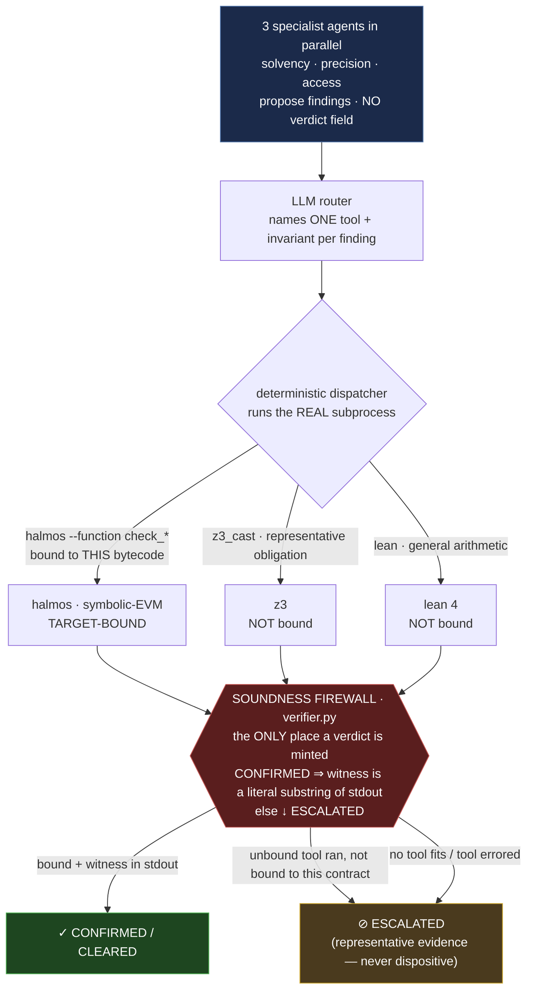

# plumbline

[](https://github.com/qizwiz/plumbline/actions/workflows/ci.yml) &nbsp;·&nbsp; **[▶ Live demo](https://qizwiz--plumbline-verification-web.modal.run)** &nbsp;·&nbsp; [the math](https://qizwiz--plumbline-verification-web.modal.run/science)

**plumbline is an autonomous multi-agent system that audits Solidity** — a team of specialist
agents (solvency, precision, access-control) propose vulnerabilities in parallel, a router agent
dispatches each finding to the formal verifier that can settle it, and a sound gate grades the
result — one the agents *cannot fool*: they have no verdict field, and a finding is confirmed only
when a real verifier subprocess emits a concrete counterexample whose witness appears verbatim in
its output. The agents' creativity is unbounded;
its authority to declare truth is zero.

> Most "AI auditors" let a language model judge its own output. That caps out around F1 0.30 and
> ships confident-but-wrong findings. plumbline replaces the model-as-judge with a *sound oracle*:
> a finding survives only if a formal verifier produces a concrete counterexample or a
> machine-checked proof.

---

## It fires — a real verdict, end to end

Point the agent at a known-buggy vault. It proposes findings, routes each to a verifier, and the
gate disposes — here, a **replayable exploit witness**, not an opinion:

```
$ plumbline audit --agent examples/synthetic-dreusd
  agent proposed 4 findings · routed each to a verifier · tools fired: halmos

  [HIGH] dreUSD.redeem            →  route: halmos
    $ halmos --function check_redeemReturnsDeposit  → CONFIRMED (2.53s, exit 1)
      witness: p_deposit_uint256_…_00 = 0x800000000000000
    verdict: ✗ CONFIRMED          # the 6↔18 decimal-scaling drain, with a replayable input
  [HIGH] dreUSDs.distributeYield  →  route: none
    verdict: ⊘ ESCALATED          # no invariant tests this economic claim → human review
  [MED]  dreUSD.mint              →  route: halmos
    $ halmos --function check_supplyAtMostBacking   → CLEARED (1.79s, exit 0)
    verdict: ✓ CLEARED            # the supply invariant is *proved* safe, not guessed

  1 confirmed · 1 cleared · 2 escalated
```

> **On non-determinism (read this — it's the point):** the proposer and router are stochastic, so
> *which* findings appear and *which* tool each routes to vary run-to-run. The gate is not: a verdict
> is a deterministic function of a real subprocess's `(stdout, exit_code)`, and a CONFIRMED requires
> the witness to appear verbatim in stdout. Re-run the printed `halmos --function …` line and you get
> the same counterexample, bit for bit. Stochastic exploration, deterministic adjudication.

Same gate, a real audited L2 protocol (`morph-l-2`), a different bug class — the off-by-one that
makes the 255th staker invisible to slashing — caught by execution, `255 → address(0)`
(`examples/morph-255-gate`). And the gate has *teeth*: on `boss-bridge` the agent routes a
signature-replay claim to halmos, halmos reports `[FAIL]` but with an **empty counterexample (`∅`)**,
and the firewall **refuses to confirm** — it escalates rather than stamp a witness it can't point at.

## The architecture (the part that's rare)



<details><summary>ASCII fallback (if mermaid doesn't render)</summary>

```
  LLM proposer  ──►  LLM router  ──►  deterministic dispatcher
  (finds bugs;       (names ONE       (runs the REAL subprocess)
   NO verdict)        tool + inv)            │
                                  ┌──────────┼───────────┐
                                  ▼          ▼           ▼
                           halmos        z3_cast       lean 4
                        (target-BOUND) (representative)(general)
                                  └──────────┼───────────┘
                                             ▼
                    ╔═══════════════════════════════════════════╗
                    ║  SOUNDNESS FIREWALL  (verifier.py)         ║
                    ║  the ONLY place a verdict is minted.       ║
                    ║  CONFIRMED ⇒ the witness MUST be a literal ║
                    ║  substring of the tool's stdout, else it   ║
                    ║  is downgraded to ESCALATED.               ║
                    ╚═══════════════════════════════════════════╝
                                             ▼
             ✓ CONFIRMED / CLEARED   ⊘ ESCALATED (unbound, no-fit, or error)
              (only halmos, bound       (z3/lean evidence kept as
               to this bytecode)         SUPPORTING, never dispositive)
```
</details>

The firewall (`tools/verifier.py`) is the single chokepoint every path funnels through, and the
LLM never reaches it: it can *route* a finding to a tool, but a verdict is a pure function of that
tool's captured `(stdout, exit_code)`. All three verifiers run on the live `--agent` path, but only
**halmos is target-bound** — it executes *this* contract's bytecode, so its CONFIRMED/CLEARED is a
fact about the actual code. `z3` (narrowing-cast / decimal-scaling obligations) and `lean 4` (a
width-independent arithmetic obligation) run as **representative** obligations: their real output is
attached as *supporting* evidence, but the finding is ESCALATED — never auto-confirmed — because the
obligation isn't bound to this bytecode. Refusing to over-claim is the whole design.

## A TLA+ model of the orchestration loop (model-checked — with honest scope)

We model the propose → route → verify → dispatch loop in TLA+ (`docs/tla/Orchestration.tla`) as an
*idealized concurrent dispatcher*, and TLC checks that under weak fairness it is **live**,
**complete**, and **starvation-free** (343 states, 0 errors). The fairness assumption is load-bearing
*in the model*: drop the dispatcher's weak fairness (`Orchestration_unfair.cfg`) and TLC returns a
starvation counterexample.

**Scope, stated honestly:** the *shipped* dispatcher is a single bounded `for`-loop that resolves
every finding by construction — so it satisfies these properties *trivially*. The TLA+ is therefore
a **design contract** for a future concurrent/queued dispatcher, not a proof that model-checking
caught a bug the current straight-line code could exhibit. (We hold our own README to the same
no-vacuous-claims bar the gate holds findings to — this scope note replaced an earlier
"the orchestration is formally verified" line that an adversarial audit flagged as an overclaim.)

```bash
cd docs/tla && java -cp tla2tools.jar tlc2.TLC -config Orchestration.cfg -deadlock Orchestration
```

(The TLA+ layer also models the smart-contract vulnerability *classes* — 40 specs in `docs/tla/`,
each a temporal spec whose TLC counterexample is bridged to a runnable Foundry test.)

## What's actually verified (measured, not claimed)

- **The gate catches real bugs with replayable witnesses** — across 4 example protocols / 6
  invariants: 3 counterexample catches (dreUSD decimals, t-swap XYK, boss-bridge replay) + 2
  proved-safe; plus the morph-l-2 255th-staker bug on a real audited L2. The full
  propose→route→dispatch→CONFIRMED loop fires end to end on `synthetic-dreusd` (1 confirmed, 1
  cleared, with a captured `stdout` sha256 per verdict).
- **Proposer lever, judge-robust** — a Sonnet proposer beats a GPT-5 single-file baseline by
  **+0.14 macro-F1** on the 24-project ScaBench corpus; the delta survives a neutral third-party
  judge (Gemini), 20/21 projects positive, bootstrap CI excludes zero. The *advantage* is robust;
  the absolute level is judge-dependent (documented honestly in `notes/`).
- **A null-verified localizer** — semi-supervised heat-diffusion from known findings localizes
  *held-out* vulnerabilities at AUC **0.79** across 16 audited protocols (5,030 functions),
  beating node-degree and trivial proximity, and **collapsing to chance (0.48) under a
  label-shuffle null** — i.e. the signal is carried by real bug locations, not graph artifacts.

## The operating model (domain-general)

1. **Reason, don't keystroke.** An agent reads the artifact and hypothesizes where a rule is
   violated — the evidence-heavy work humans never did well at scale.
2. **Verify against ground truth.** Every conclusion is checked by a sound oracle — halmos
   symbolic-EVM execution that returns a concrete counterexample or a proof. A finding counts *only*
   if the verifier confirms it on this bytecode; nothing confident-but-wrong survives.
3. **Escalate judgment.** Anything the gate cannot soundly settle — no matching invariant, an empty
   witness, an unbound obligation — is escalated, never auto-accepted.

Agents take the rule-bound load; a verified layer governs them; humans handle only what needs a
person. Governance is baked into the architecture, not painted on top — *safe by design* means the
verdict comes from a sound verifier, not the agent's say-so, and *auditable* means the basis for a
finding is a replayable counterexample you can hand a regulator, not "the model said so."

## Why this is rare

One engineer at an intersection almost no one occupies — **AI-agent orchestration** (an LLM that
plans, calls real tools, observes their output, and concludes) × **formal verification** (halmos,
z3, Lean 4) × **sound-systems discipline** (the signal *governing* the agent must itself be
verified, or the system confidently lies). The model is commodity. The verified governance layer —
an agent that structurally *cannot* author its own verdict — is the moat.

## The structural prior (one input, honestly bounded)

plumbline can rank functions by call-graph centrality / curvature as a *where-to-look* prior. Be
precise about what holds: **on its own, unsupervised structural ranking does not beat plain node
degree** — tested across 16 protocols / 5,030 functions, degree wins (a negative result we ran and
report). What *does* work is the **seeded** version above — heat-diffusion from known findings
(AUC 0.79, null-verified). The prior is an attention router for the proposer, not a detector.

## Honest status

A demonstrated capability, not a shipped product: an autonomous LLM agent + a **real halmos
symbolic-EVM gate** (the only target-bound verifier) that catches correctness violations on real
code with replayable counterexamples, behind a soundness firewall the agent cannot bypass. `z3` and
the `lean 4` obligation run on the live `--agent` path too, but as *representative* obligations
(supporting evidence → ESCALATED, never dispositive). TLC exists only in standalone scripts, off the
live path. The localizer and proposer levers are independently null-/judge-verified. What's next is
breadth (more artifact shapes) and a grounded learning layer over the accumulating case library —
learning from the gate's verified verdicts, not surface similarity.

## Can I point it at my own contract?

Point it at **any** Solidity and the agent reads it and proposes findings — that part is
contract-agnostic. A *target-bound* verdict (a green CLEARED or a red CONFIRMED) additionally needs
a Foundry `check_*` invariant for halmos to execute against the real bytecode; the bundled examples
ship hand-written ones. On code with **no** invariant the agent still proposes, but every finding
**ESCALATES to a human** — nothing is rubber-stamped (see the `boss-bridge` run, where the gate
refuses to confirm a claim it can't bind to a test). Auto-synthesizing that invariant from the
proposed finding — turning *audits the examples* into *audits anything* — is the next build.

## Quickstart

```bash
git clone <repo> && cd plumbline
./bootstrap.sh                                                 # deps (~30s)

# $0, no LLM key — reproduce a raw gate-fire:
cd examples/synthetic-dreusd && forge build
../../.venv/bin/halmos --function check_redeemReturnsDeposit   # → Counterexample, ~1s

# the full agent loop (needs an OpenRouter key for the proposer/router):
bin/plumbline audit --agent examples/synthetic-dreusd
```

Two dashboards over recorded runs: `python tools/web.py` → `:5050/verification` (the local
reasoning-trace view), and `deploy/` — a self-contained, key-less, $0-per-view public app
(`app.py` + `Dockerfile`) that serves precomputed runs only, safe to deploy.

## Layout

| Path | Role |
|------|------|
| `tools/orchestrator.py` | the agent loop — propose → route (LLM names tool + invariant) → dispatch the real subprocess |
| `tools/verifier.py` | **the soundness firewall** — the only place a verdict is minted; CONFIRMED requires the witness to be a literal substring of captured stdout |
| `tools/cli.py` | `plumbline audit` / `scan` — the proposer (`_run_proposer`, live LLM via OpenRouter) and invariant discovery |
| `halmos_check.py` | the symbolic-EVM gate — runs `check_*` invariants against the real bytecode, parses counterexamples |
| `lean/SummaryObligation.lean` | a Lean 4 obligation for the bounded-arithmetic core — **machine-checks**, 0 `sorry`, 0 axioms (`lean lean/SummaryObligation.lean` → exit 0, ~3s, no Mathlib/lake). Routable as a representative obligation; not yet target-bound. |
| `geom_dirichlet_probe.py` | the null-verified semi-supervised localizer |
| `tools/web.py`, `deploy/` | the eval/observability dashboards (`/verification`) |
| `examples/` | runnable gate-fires (synthetic-dreusd, t-swap, boss-bridge, morph-255-gate) |

---

*Built by Jonathan Hill — Foresight Institute Computation Group.*
